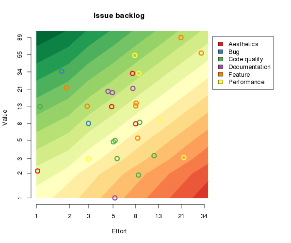

# Backlog

| Issue | Description | Value | Effort | ROI | Blocked by |
| ----: | ----------- | ----: | -----: | --: | ---------: |
| [152](https://github.com/timgurto/mmo/issues/152) | Prevent gathering/deconstructing when object has an inventory | 34 | 2 |  |  |
| [156](https://github.com/timgurto/mmo/issues/156) | Fix ambiguity of Object::removeItem() and Object::removeItems() | 13 | 1 |  |  |
| [149](https://github.com/timgurto/mmo/issues/149) | Choose gather item based on gathers left, not nominal quantity | 21 | 2 |  |  |
| [162](https://github.com/timgurto/mmo/issues/162) | Cull objects | 55 | 8 |  |  |
| [154](https://github.com/timgurto/mmo/issues/154) | Allow giving away or begging for goods via trade | 13 | 3 |  |  |
| [148](https://github.com/timgurto/mmo/issues/148) | Document XML interface | 21 | 5 |  |  |
| [146](https://github.com/timgurto/mmo/issues/146) | Document Texture interface | 21 | 5 |  |  |
| [161](https://github.com/timgurto/mmo/issues/161) | Cull players | 34 | 8 |  |  |
| [60](https://github.com/timgurto/mmo/issues/60) | Add particle effects when cutting down a tree | 34 | 8 |  |  |
| [95](https://github.com/timgurto/mmo/issues/95) | Fix scroll-bar dragging offset | 8 | 3 |  |  |
| [83](https://github.com/timgurto/mmo/issues/83) | Sort _materials and _craftableItems by name, not ID | 13 | 5 |  |  |
| [145](https://github.com/timgurto/mmo/issues/145) | Document UI interface | 21 | 8 |  |  |
| [93](https://github.com/timgurto/mmo/issues/93) | Allow terrain types to be marked as non-blending | 2 | 1 |  |  |
| [130](https://github.com/timgurto/mmo/issues/130) | Make trees drop branches over time | 13 | 8 |  |  |
| [129](https://github.com/timgurto/mmo/issues/129) | Add grass objects, which grow naturally on grass tiles | 13 | 8 |  |  |
| [100](https://github.com/timgurto/mmo/issues/100) | Optimize container types for faster iteration | 3 | 3 |  |  |
| [138](https://github.com/timgurto/mmo/issues/138) | Use set::count() and map::count() to test set membership | 5 | 5 |  |  |
| [101](https://github.com/timgurto/mmo/issues/101) | Change dynamic_casts that don't check their result to static_cast or check for nullptr | 5 | 5 |  |  |
| [163](https://github.com/timgurto/mmo/issues/163) | Create generic particle system | 8 | 8 |  | 60 |
| [128](https://github.com/timgurto/mmo/issues/128) | Use forward declarations where possible, to reduce unnecessary #includes | 8 | 8 |  |  |
| [74](https://github.com/timgurto/mmo/issues/74) | Throw exceptions where appropriate on SDL-function failures | 3 | 5 |  |  |
| [137](https://github.com/timgurto/mmo/issues/137) | Allow a recipe to create multiple item types | 5 | 8 |  |  |
| [160](https://github.com/timgurto/mmo/issues/160) | Cull terrain | 8 | 13 |  |  |
| [32](https://github.com/timgurto/mmo/issues/32) | Document and improve use of various disconnects | 1 | 5 |  |  |
| [72](https://github.com/timgurto/mmo/issues/72) | Move SDL functions and types to a namespace | 2 | 8 |  |  |
| [140](https://github.com/timgurto/mmo/issues/140) | Move appropriate configuration details into config file | 3 | 13 |  |  |
| [133](https://github.com/timgurto/mmo/issues/133) | Switch from MinGW to Clang | 3 | 21 |  |  |
