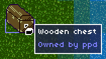

# Tooltip Builder

[Home](../index.md)

This interface is used to create tooltip textures on the client.  They have a semi-transparent dark blue background, a white border, and light-blue text by default (see example image below).  The process revolves around `TooltipBuilder` objects, each of which describes a complete tooltip, and can be published into the final texture.

The library is located in `client\TooltipBuilder.(cpp|h)`.

## Usage
### 1. Create builder object
```cpp
#include "TooltipBuilder.h"
TooltipBuilder tb;
```

### 2. Construct contents
The tooltip contents are specified imperatively, top-to-bottom.  The available commands are:

#### Add a line of text: `addLine()`
```cpp
tb.addLine("Helpful text");
```

#### Add a gap: `addGap()`
Add a gap between two consecutive lines.  Useful for emphasizing a title, e.g. an item or object name that is followed by more detailed information.
```cpp
tb.addLine("Line  of text");
tb.addGap();
tb.addLine("This line will be separated from the first.");
```

#### Change the typeface or font size: `setFont()`
Specify an SDL_TTF font object that will be used for subsequent lines of text.  When no argument is provided, and initially, the `TooltipBuilder` object uses a static default (`TTF_Font *TooltipBuilder::_defaultFont`).
```cpp
TTF_Font *comic = TTF_OpenFont("comic sans.ttf", 10);

tb.addLine("This line will be in the normal font.");
tb.setFont(comic);
tb.addLine("This line will be in a different font.");
tb.setFont();
tb.addLine("This line will be in the normal font.");

TTF_CloseFont(comic);
```

#### Change the color: `setColor()`
Specify a color that will be used for subsequent lines of text.  When no argument is provided, and initially, the `TooltipBuilder` object uses a static default (`Color TooltipBuilder::DEFAULT_COLOR`).
```cpp
tb.addLine("This line will be in the normal color.");
tb.setColor(Color::RED);
tb.addLine("This line will be in red.");
tb.setColor();
tb.addLine("This line will be in the normal color.");
```

### 3. Publish texture: `publish()`
This returns a `Texture` by copy.
```cpp
Texture tooltipTexture = tb.publish();
```

## Example
```cpp
TooltipBuilder tb;
tb.setColor(Color::WHITE);
tb.addLine("Wooden chest");
tb.setColor();
tb.addGap();
tb.addLine("Owned by ppd");
tb.publish();
```
